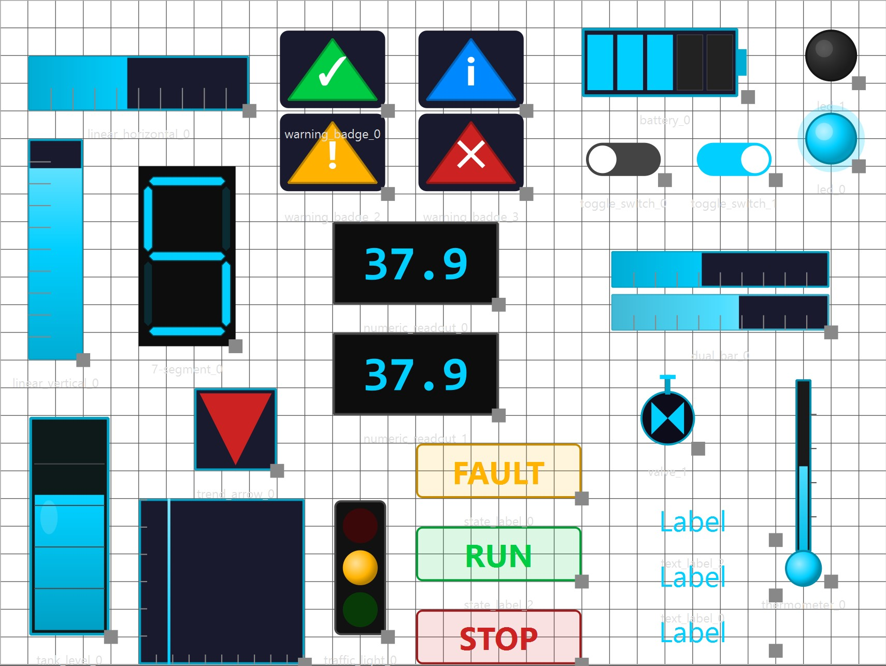
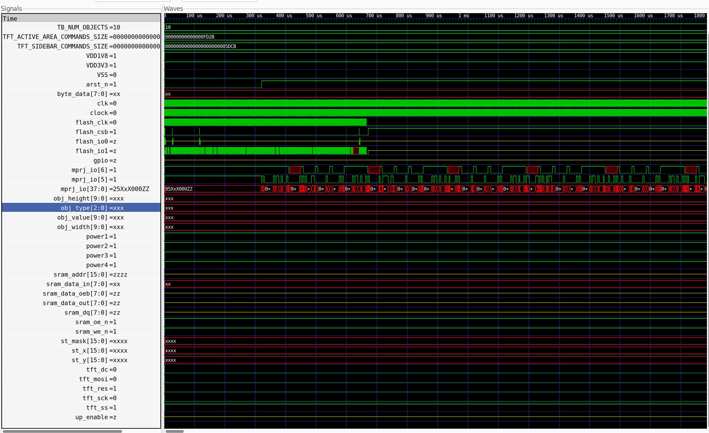
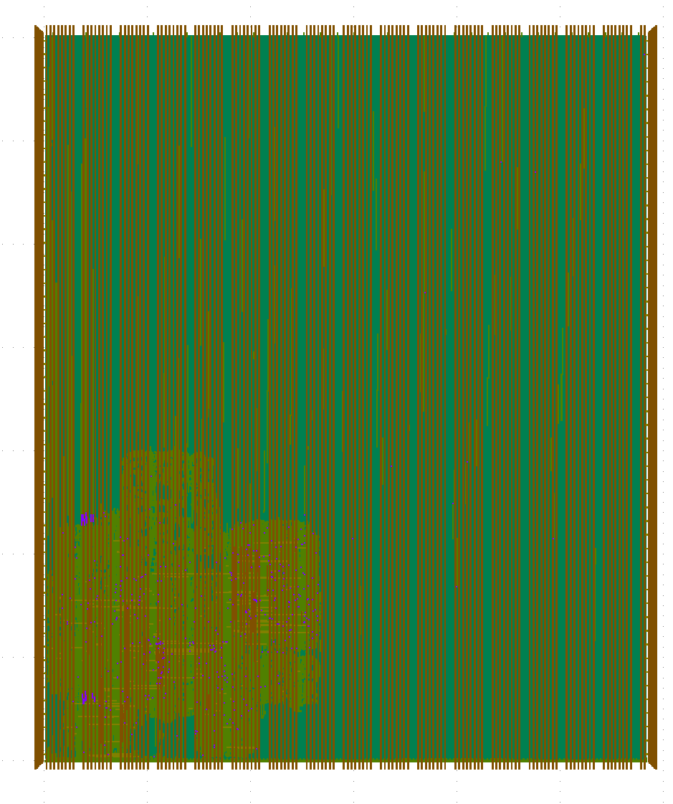
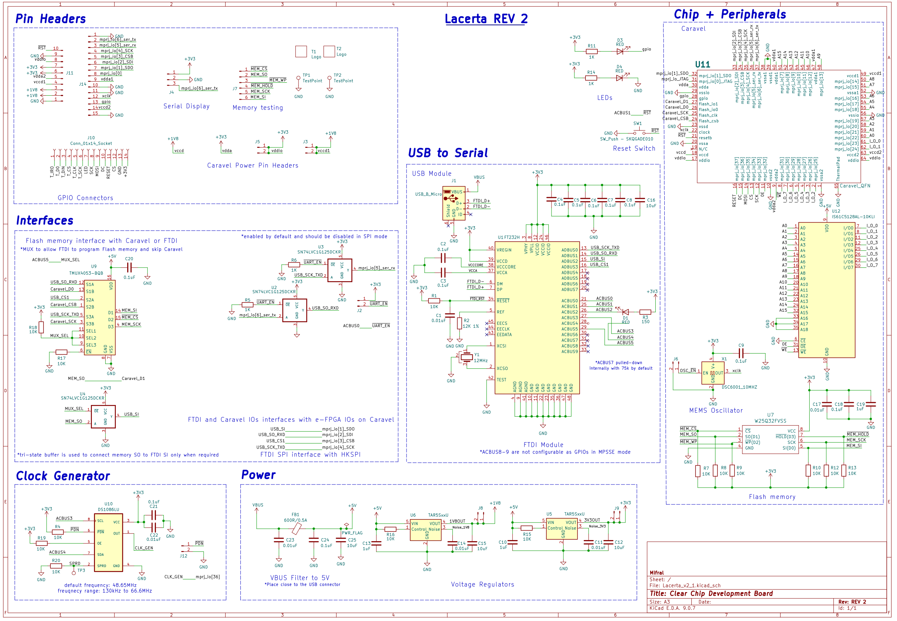
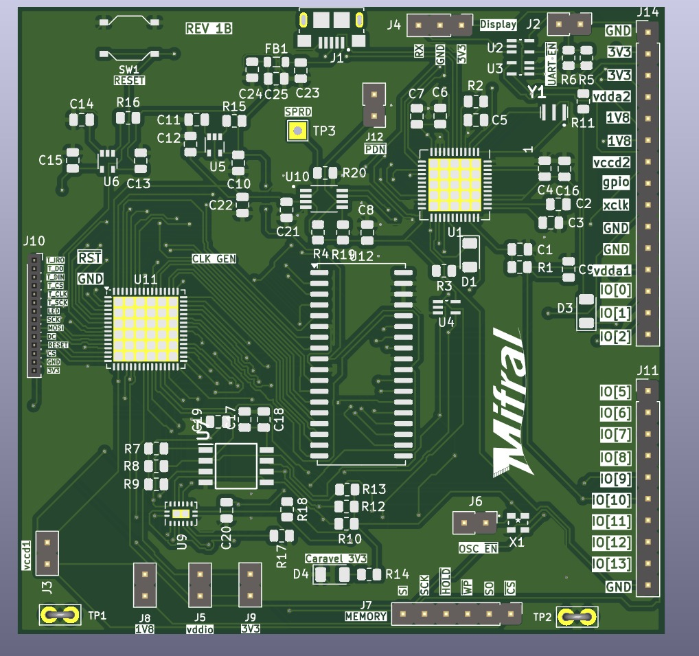
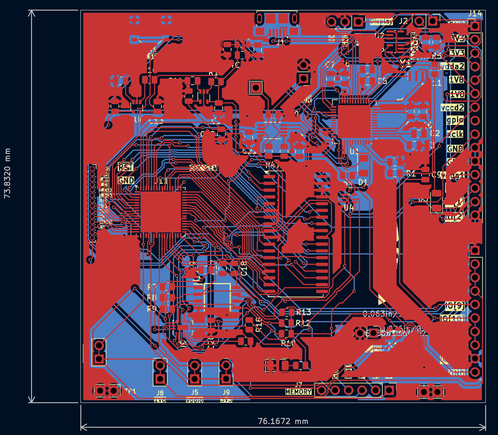

<p align="center">
  
</p>

# Lacerta: Open Hardware Interface Engine for Embedded Systems


## Project Overview

**Lacerta** is an open-source hardware platform that enables the rapid creation of graphical interfaces for embedded systems using custom silicon.

**The whole documentation can be found** [**here**](https://mifraltech.github.io/Lacerta_CF/).

The system allows developers to design graphical interfaces using a graphical configuration tool and deploy them directly to hardware implemented in a custom ASIC integrated with the Caravel SoC platform. The hardware renders the interface in real time and outputs the result to SPI-driven TFT/OLED screens commonly used in embedded devices.

The generated interface may include visual components such as:

- Buttons
- Horizontal and vertical bars
- Numeric indicators
- Status indicators
<p align="center">

</p>
<p align="center">
<b>Figure 1.</b> Examples of graphical components supported by Lacerta, including buttons, horizontal and vertical bars, numeric indicators, graphics, and status indicators used to visualize real-time system data.
</p>

The ASIC receives information via UART streams and supports two main modes of operation for updating the display:

1. **Direct Mode:** Data received via UART is sent directly to the user project area. In this mode, the values are updated on the SPI TFT/OLED screen with minimal latency, ideal for simple or time-critical updates.

2. **Processing Mode:** Data from UART is first routed to the integrated RISC-V core, where any mathematical operations, functions, or custom logic can be applied. After processing, the results are sent to the user project area to update the display. This mode is suitable for applications requiring data manipulation or more complex interface logic.

This flexible architecture allows Lacerta to efficiently manage multiple inputs and screen objects using a single UART protocol, adapting to both straightforward and advanced use cases. Any other signal types must be converted to UART beforehand by external interface circuitry or preprocessing devices.

<p align="center">

</p>
<p align="center">
<b>Figure 2.</b> Lacerta system concept: signals are processed by the Lacerta ASIC to generate the custom graphical HMI displayed on SPI-driven TFT/OLED displays for compact embedded installations.
</p>


# System Architecture Summary

The Lacerta platform is an open-source embedded graphics system built from four main parts: custom silicon, board-level hardware, firmware/control logic, and interface software. Together, these layers allow a host system to load graphics data, update interface objects, and drive a small SPI-connected display efficiently.

## Core architecture

Lacerta platform is a custom ASIC implemented in the **SKY130 process** and integrated inside the **Caravel user project area**. This subsystem realizes the hardware graphics engine that receives interface commands, updates the internal display state, and generates the output stream presented on the display.

The Lacerta ASIC follows a memory-centric architecture. Configuration data and runtime values enter the system through **UART**. Depending on the selected operating mode, the received data can be forwarded directly to the user project area or first processed by the embedded **Caravel RISC-V** processor. Internal transactions are routed through the **Wishbone interconnect** to the rendering logic, which updates the frame contents stored in memory. The display output block then reads that memory and continuously converts it into the signal required by the connected **SPI TFT/OLED display**.

The ASIC includes the following main modules:

- the external SRAM interface,
- the TFT SPI interface,
- the UART command interface,
- the Wishbone interface,
- the screen update logic,
- the drawing logic,
- and the shared memory subsystem.


<p align="center">

</p>
<p align="center">
<b>Figure 3.</b> Block diagram of the Lacerta ASIC inside the Caravel environment. The figure shows how UART data and the embedded Caravel RISC-V processor interact through the Wishbone-connected control path, rendering logic, and memory subsystem; the updated frame data is then read by the display output block to drive the screen.
</p>


## Main subsystems

### Memory subsystem

The memory subsystem manages buffered access to external SRAM. It uses FIFOs, read/write buffering, and arbitration logic so several blocks can share memory safely without needing to handle low-level SRAM timing directly.

### Screen output subsystem

The screen path reads pixel data from memory and converts it into SPI transactions for the display. It supports TFT initialization, full or partial region refreshes, and a color lookup mechanism that maps compact pixel codes to RGB565 values. This reduces memory usage and makes repeated HMI colors efficient to store.

### Drawing subsystem

The drawing logic updates only the parts of the image that change. The `mask_generator` reads current pixel data, modifies selected regions based on object type, writes the result back to SRAM, and then triggers a refresh of the affected rectangle. This makes the system well suited for HMI elements such as bars, graphs, booleans, and segmented displays.

### Command and control subsystem

The control path is coordinated by `command_arbiter_decoder`, which receives transactions from UART and Wishbone interfaces and turns them into actions such as memory access, object redraws, screen refreshes, color-table updates, and reset/control operations.

### UART and Wishbone interfaces

UART provides an external host-facing command port for loading assets, configuring the display, and triggering updates. Wishbone provides processor-oriented access to both control registers and shared memory, allowing the embedded Caravel processor or another SoC master to work with the same graphics system.

## Typical operation

In normal use, a host first loads graphics assets or configuration data into SRAM. The display is initialized, then object updates are triggered through UART or processor commands. The drawing engine modifies only the required image region in memory, and the screen subsystem refreshes only that changed rectangle on the TFT. This avoids full-screen redraws and improves efficiency for dynamic interfaces.

## Lacerta board role

The Lacerta Board packages the SoC with the supporting hardware needed for practical use, including power regulation, clocking, USB-to-serial connectivity, SPI Flash support, GPIO access, and display/peripheral connections. It serves as the physical platform for development, testing, and demonstration of the Lacerta graphics architecture.

# System Development

The development of the Lacerta platform spans the complete hardware and software realization flow, from digital design and verification to physical implementation and system-level integration. This section describes the main stages used to transform the Lacerta concept into a functional platform, including RTL design, verification, layout generation, gate-level validation, PCB development, and the creation of the interface design software.

Together, these activities define the engineering workflow followed to implement, test, and deploy Lacerta as an open-source embedded graphical interface system. Each subsection highlights a different part of this process and explains how the individual development tasks contribute to the final platform.

## Lacerta RTL

**RTL code can be found** [**here**](https://github.com/MifralTech/Lacerta_CF/tree/main/verilog/rtl).

### System Purpose

The system is designed to display graphical HMI content on a TFT screen and to update only the screen regions that change.

At a functional level, the system must:

- receive commands and image-related data,
- store image bytes and mask bytes in external SRAM,
- modify selected objects inside the stored image,
- fetch the corresponding pixel data,
- convert logical pixel information into display colors,
- and transmit the final bytes to the TFT controller.

The design is organized around a shared memory architecture. Instead of each module touching the SRAM directly, all active clients use a common memory subsystem with buffered read and write channels, as shown in the figure below.

### High-Level Functional Flow

The complete display flow is:

1. A host or processor sends control commands or image data.
2. The command path decodes the request and either:
   - writes data into the shared memory system,
   - updates display-related configuration,
   - or starts a drawing operation.
3. The memory subsystem transfers bytes between internal buffers and external SRAM.
4. If an HMI object changes, `mask_generator` reads the corresponding image region, updates the stored bytes, and writes the modified data back into SRAM.
5. Once the image region is ready, `screen_system` requests the affected window from memory.
6. `tft_control_fsm` streams TFT commands and pixel bytes through `spi_master`.
7. The TFT receives only the updated region instead of a full-screen redraw.

This makes the system well suited for dashboards, indicators, bars, graphs, and symbolic objects that change frequently in small areas.

### Top-Level Integration (User Project Wrapper)

#### `dig_top.v` 

`dig_top` is the main integration point of the RTL system.
It connects:
- the UART interface,
- the Wishbone interface,
- the external SRAM,
- the TFT SPI pins,
- the shared memory subsystem,
- the drawing engine,
- and the display engine.
Its main functional job is to route requests from several clients into the memory system and to coordinate which subsystem is producing or consuming pixel data.

The clients connected to the shared memory system are:

- UART host write path,
- UART host read path,
- screen-system read path,
- drawing-engine read path,
- drawing-engine write path,
- Wishbone memory read path,
- Wishbone memory write path.

Inside `dig_top`, each client is assigned to a dedicated buffer slot. The top-level combinational logic packs the individual requests into the vectors expected by `mem_sys`.

`dig_top` also derives the frame-update rectangle used by the display block:

- `frame_st_x`
- `frame_end_x`
- `frame_width`
- `frame_st_y`
- `frame_end_y`
- `frame_height`
- `frame_st_pix`

These values are taken from the drawing object parameters so that, after a drawing operation, the correct screen region can be refreshed automatically.

Another important top-level task is Wishbone routing. `dig_top` chooses whether a Wishbone transaction goes to:

- `wb_slave_memory_mapped` for control/MMIO accesses,
- or `wb_slave_to_mem_sys_ports` for direct SRAM-backed data accesses.

### End-to-End Operation Examples

#### Example 1: Loading image data from UART

1. The host sends UART packets.
2. `uart_ip_memory_mapped` converts them into internal writes.
3. `command_arbiter_decoder` interprets those writes as host memory-transfer commands.
4. The host write buffer receives the data bytes.
5. `mem_sys` schedules the write burst.
6. `buffers_discharger` sends the bytes to SRAM through `sram_controller`.

#### Example 2: Updating an HMI object

1. The host or processor writes object parameters.
2. `command_arbiter_decoder` stores width, height, position, object value, and memory addresses.
3. A start command asserts `drw_inc_start`.
4. `mask_generator` begins a read-modify-write sequence.
5. The old bytes are fetched from SRAM through `mem_sys`.
6. The updated bytes are written back to SRAM through `mem_sys`.
7. `mask_generator` asserts `ss_start`.
8. `screen_system` refreshes the affected rectangle on the TFT.

#### Example 3: Refreshing the sidebar

1. A control write asserts `ss_ld_sidebar`.
2. `tft_control_fsm` programs the sidebar coordinates into the TFT.
3. It requests the corresponding SRAM burst.
4. Two bytes per pixel are read.
5. Those bytes are transmitted directly through `spi_master`.

### Main Functional Role of Each Major Module

- `dig_top`: integrates the whole system and routes all subsystem interfaces.
- `command_arbiter_decoder`: converts UART/Wishbone commands into internal control actions.
- `uart_ip_memory_mapped`: converts UART packets into internal memory-mapped transactions.
- `wb_slave_memory_mapped`: converts Wishbone MMIO accesses into control transactions.
- `wb_slave_to_mem_sys_ports`: converts Wishbone data accesses into shared-memory bursts.
- `mem_sys`: arbitrates shared access to external SRAM.
- `buffers`: stores temporary read and write data for all clients.
- `buffers_filler`: fills read buffers from SRAM.
- `buffers_discharger`: empties write buffers into SRAM.
- `sram_controller`: drives the physical SRAM pins.
- `mask_generator`: updates image regions according to HMI object logic.
- `screen_system`: top display block for TFT output.
- `tft_control_fsm`: performs TFT initialization and region-based pixel transfer.
- `color_mapping_table`: converts compact pixel codes into RGB565 colors.
- `spi_master`: serializes commands and pixel bytes onto the TFT SPI bus.


## Lacerta Verification

**Verilog TB code can be found** [**here**](https://github.com/MifralTech/Lacerta_CF/tree/main/verilog/dv/lacerta).

A layered verification strategy was used to validate Lacerta from block level up to full-system behavior. The intent was not only to prove that individual modules operate correctly in isolation, but also to verify that the complete command, memory, drawing, and display paths remain coherent when exercised through the same interfaces used in deployment.

At the block level, dedicated environments were created for the UART front end, the shared memory subsystem, the Wishbone adapters, the command decoder, and the display-related logic. These environments focused on local protocol correctness, handshake legality, data stability, and forward progress. The later sections of this document list the principal checks captured for each block.

At the system level, the main integration environment is `verif/dig_top_tb.sv`. This testbench drives the top-level `dig_top` instance through the UART path, connects the design to an SRAM behavioral model (`CY7C1049GN_i`), and observes the TFT SPI outputs exactly as a real deployment would use them. In practice, this makes the testbench an end-to-end verification vehicle: a command is injected as UART traffic, decoded by the control plane, executed through the memory subsystem, and finally checked either at the SRAM image or at the TFT serial output.

<p align="center">

</p>
<p align="center">
<b>Figure 4.</b> The diagram summarizes the main verification components, including the clock and reset infrastructure, golden reference data, stimulus path, UART bus functional model, SRAM model, and checker logic used to validate the DUT behavior during gate-level simulation.
</p>

More information about the simulation flow, active checkers, and expected data paths can be found in [dig_top_tb_flow_diagram.html](docs/assets/downloads/dig_top_tb_flow_diagram.html).


### System-Level Verification

The full-system verification flow is organized around three complementary ideas:

1. **Interface-faithful stimulus**  
   The testbench does not force deep internal signals to mimic system behavior. Instead, it uses the UART Bus Functional Model (`uart_bfm`) and the helper task `uart_write_mem()` to generate valid command packets byte by byte. This ensures that the UART receive path, packet decoder, command arbiter, and downstream blocks are exercised together.

2. **Independent reference data**  
   The testbench builds its own expected data structures before execution begins:
    `tft_init_mem` stores the expected TFT initialization sequence, including command, data, and delay entries.
    `tft_sidebar` stores the expected sidebar stream sent to the TFT.
    `tft_active_area` stores the logical active-screen image used for full-frame display verification.
    `tb_sram` acts as a golden SRAM image. It is initialized from the active-area data and then updated by the testbench's own object-drawing rules before being compared against the DUT-visible SRAM model.

3. **Concurrent checking**  
   Verification is not deferred to a single final comparison. The testbench runs several checker threads in parallel, so protocol violations, timing mismatches, stream ordering errors, and memory corruption are detected close to the cycle where they occur. This is especially important for gate-level simulation, where failures may arise from control sequencing or handshake timing rather than purely functional logic.

### `dig_top_tb.sv` Verification Flow

The top-level testbench starts from a simple but realistic infrastructure:

- a 50 MHz clock generated with `always #10ns clk = !clk;`,
- an active-low reset released after 40 ns,
- an SRAM behavioral model connected to the external-memory pins,
- UART-driven stimulus,
- a serial-output checker for the TFT SPI path,
- and a 30-second timeout thread to convert deadlock into an explicit failure.

After reset, the system verification scenario progresses through the following phases.

#### 1. TFT initialization memory programming

The testbench writes every entry of `tft_init_mem` through UART to the control address used by the screen subsystem. This stage verifies that Lacerta accepts configuration traffic through the host path and correctly stores screen-initialization data before any display action is requested.

#### 2. TFT initialization sequence execution

Once the initialization table is loaded, the testbench configures the SPI clock divider and triggers screen initialization. A dedicated checker thread waits until the TFT control FSM enters its initialization state and then validates each emitted entry:

- for command/data entries, the checker compares `{rom_type, tnsm_data}` against the expected `tft_init_mem` content;
- for delay entries, it measures the elapsed clock cycles and confirms that the observed delay is at least the programmed number of milliseconds multiplied by `CLK_CYCLES_PER_MS`.

This stage verifies more than register programming. It checks that the initialization ROM is consumed in the correct order, that delay entries are honored in time, and that the SPI path receives the exact bytes expected by the TFT controller. After the sequence completes, the testbench asserts that `initialization_done` is high.

#### 3. Sidebar transfer verification

The testbench then prepares a burst write into the shared memory system and streams the sidebar payload through repeated UART writes. After the sidebar-load command is issued, the testbench checks both control behavior and output behavior:

- `sidebar_ongoing` must assert after the command and later deassert when the transfer completes;
- the read buffer must be empty and the read-page generator must be idle at the end of the operation;
- every SPI byte transmitted during the sidebar update must match the expected `tft_sidebar` sequence;
- the `tft_dc` line must indicate command bytes for `CASET`, `RASET`, and `RAMWR`, and data bytes everywhere else.

This verifies the complete path from host programming, to SRAM write buffering, to screen-system memory fetch, to TFT serialization.

#### 4. Color-mapping table programming

The testbench writes randomized RGB565 values into every color-map entry and then reads the corresponding internal table state after a short propagation delay. This confirms that compact logical pixel codes used in the screen image are translated through the correct table entries before being sent to the TFT interface.

#### 5. Full active-screen fetch and display

To verify full-image display behavior, the testbench first loads the active-screen image into SRAM through the UART-controlled write path. It then programs object geometry fields so the screen subsystem fetches the entire active display region and emits it over SPI.

During this phase, the verification logic checks:

- that the TFT control FSM asserts `busy` after the fetch request and later returns to idle;
- that the read buffer is empty and the page generator is no longer busy after completion;
- that the command/window bytes (`CASET`, `RASET`, `RAMWR`, and coordinate bytes) match the expected `tft_active_area` header;
- that each logical pixel in `tft_active_area` is converted into the correct two-byte RGB565 value using the live `color_map` table;
- and that the command/data framing on `tft_dc` remains correct during the whole transfer.

This is an important system-level check because it validates the interaction among stored pixel data, color expansion, frame-window generation, TFT command sequencing, and SPI serialization.

#### 6. Constrained-random drawing-object verification

After the static display paths are verified, the testbench executes `TB_NUM_OBJECTS` randomized drawing scenarios. For each iteration it selects:

- an object type,
- object width and height,
- a value parameter,
- a legal start position (`st_x`, `st_y`),
- and, for mask objects, a legal mask-source base address.

The object type rotates through the drawing modes implemented in the testbench tasks:

- `draw_horizontal_type()`
- `draw_vertical_type()`
- `draw_graph_type()`
- `draw_mask_type()`

Each task programs the DUT through UART exactly as software would: it writes object type, dimensions, start address, screen coordinates, and trigger/value fields. The testbench then waits for the drawing engine completion handshake (`MASK_GEN_PATH.done`) and updates the shadow image `tb_sram` according to an independent expected-behavior model:

- **Horizontal object:** the MSB of each target pixel is set according to the horizontal position relative to `obj_value`.
- **Vertical object:** the MSB of each target pixel is set according to the vertical position relative to `obj_value`.
- **Graph object:** the existing region is shifted and a new column is inserted, modeling graph-history behavior rather than a simple overwrite.
- **Mask object:** the update uses a second memory region as the mask source, stressing source/destination addressing interactions.

After every object operation, `check_sram_consistency()` compares the golden `tb_sram` contents against the actual external SRAM model seen by the DUT. This immediate comparison is valuable because it localizes failures to the most recent object operation instead of postponing diagnosis to the end of the simulation.

#### 7. Microprocessor-enable handoff

At the end of the scenario, the testbench issues the UART command that enables the embedded microprocessor path and verifies that `up_enable` is asserted. This closes the loop on one more top-level control action and ensures the system can hand control to the processor-side flow after host-side configuration.

### Active Checker Structure

The `dig_top_tb.sv` environment contains several simultaneously active verification mechanisms:

- **TFT initialization checker:** validates initialization bytes and delay lengths.
- **Sidebar stream checker:** validates TFT payload bytes and command/data framing.
- **Active-area stream checker:** validates frame-window commands and RGB565-expanded pixel output.
- **SRAM shadow-model checker:** compares the expected image memory against the SRAM model after each draw operation.
- **SPI serialization checker:** samples `tft_mosi` on `tft_sck` edges and confirms that every acknowledged `tnsm_data` byte is serialized MSB first.
- **Control/status assertions:** check flags such as `initialization_done`, `sidebar_ongoing`, `busy`, buffer-empty conditions, and `up_enable`.
- **Timeout protection:** terminates the simulation with a fatal error if the full scenario fails to make progress within 30 seconds.

Together, these checkers provide both transaction-level and bit-level confidence. A failure can therefore be caught as a bad control transition, a wrong memory update, an incorrect TFT byte, or even a serialization mismatch on the SPI output pin.

### Relation to GLS and Documentation Artifacts

This same end-to-end style is especially useful for gate-level simulation because it exercises long control sequences, back-pressure conditions, and external-interface timing without simplifying the problem to a purely combinational comparison. More detailed information about the simulation flow, active checkers, and expected data paths can be found in [dig_top_tb_flow_diagram.html](docs/assets/downloads/dig_top_tb_flow_diagram.html). That file documents the actual structure implemented in `dig_top_tb.sv`: UART-driven initialization, sidebar transfer, color-map programming, full active-area fetch, constrained-random object drawing with per-object SRAM comparison, and final processor enable.

Overall, the Lacerta verification methodology combines block-level protocol checking, system-level end-to-end stimulus, reference-model comparison, and gate-level observability. This gives strong confidence that the platform is not only logically correct, but also integration-ready across its communication, memory, drawing, and display subsystems.

### WB Slave to Memory Mapped

The verification plan for the **WB Slave to Memory Mapped** block focuses on protocol correctness, proper memory-side control generation, and legal read/write handshaking.

1. Verify that the Wishbone slave acknowledges only when a valid master request is active.
2. Verify that an active Wishbone request is acknowledged within the maximum allowed number of clock cycles.
3. Verify that `wb_ack_o` is asserted for only one clock cycle per transaction.
4. Verify that address, data, and control signals remain stable while a request is active and has not yet been acknowledged.
5. Verify that `mem_we` is asserted, and `mem_re` is not asserted, during Wishbone write requests.
6. Verify that `mem_re` is asserted, and `mem_we` is not asserted, during Wishbone read requests.
7. Verify that `wb_cyc_i` and `wb_stb_i` are deasserted only after `wb_ack_o`, preventing overlapping requests.
8. Verify that `mem_waddr`, `mem_wdata`, and `mem_wmask` correctly reflect the Wishbone address, data, and byte-select signals during write requests.
9. Verify that `mem_raddr` correctly reflects the Wishbone address during read requests.
10. Verify that `wb_dat_o` returns the same data received from memory when a Wishbone read request completes.
11. Verify that `mem_wr_data_ack` can be asserted only while a Wishbone write transaction is in progress.
12. Verify that `mem_rdy` can be asserted only while a Wishbone read transaction is in progress.

### WB Slave to Read/Write Ports

The verification plan for the **WB Slave to Read/Write Ports** block checks correct Wishbone behavior, proper coordination with the memory-system ports, and correct sequencing of read and write transactions initiated by the microprocessor side.

1. Verify that the Wishbone slave acknowledges only when a valid master request is active.
2. Verify that `wb_ack_o` is asserted for only one clock cycle per transaction.
3. Verify that address, data, and control signals remain stable while a request is active and has not yet been acknowledged.
4. Verify that `wpg_busy` is asserted only for Wishbone write requests and remains clear for read requests.
5. Verify that `wpg_busy` remains asserted until `wpg_ack` is received.
6. Verify that `rpg_busy` is asserted only for Wishbone read requests and remains clear for write requests.
7. Verify that `rpg_busy` remains asserted until `rpg_ack` is received.
8. Verify that `wb_cyc_i` and `wb_stb_i` are deasserted only after `wb_ack_o`, preventing overlapping requests.
9. Verify that `up_en` does not change while a read or write process is in progress.
10. Verify that `up_soft_reset` does not change while a read or write process is in progress.
11. Verify that `wpg_st_addr`, `wpg_burst_length`, and `wr_buff_wdata` are correctly loaded during Wishbone write requests.
12. Verify that `wpg_st_addr`, `wpg_burst_length`, and `wr_buff_wdata` remain stable until `wpg_ack` is asserted.
13. Verify that `rpg_st_addr` and `rpg_burst_length` are correctly loaded during Wishbone read requests.
14. Verify that `rpg_st_addr` and `rpg_burst_length` remain stable until `rpg_ack` is asserted.
15. Verify that `wr_buff_wren` is asserted only during Wishbone write requests and only once per write transaction.
16. Verify that `rd_buff_rden` is asserted only during Wishbone read requests and exactly `NUM_ACCESSES` times per read transaction.
17. Verify that `rpg_ack` can be asserted only while a master read operation is ongoing.
18. Verify that `wpg_ack` can be asserted only while a master write operation is ongoing.
19. Verify that a Wishbone read transaction completes when `rpg_ack` is asserted.
20. Verify that a Wishbone write transaction completes when `wpg_ack` is asserted.
21. Verify that the read buffer is empty whenever no Wishbone read operation is in progress.
22. Verify that the data returned at the end of a Wishbone read matches the data delivered by the memory system.
23. Verify that Wishbone read and write transactions can start only when the microprocessor interface is enabled and not in soft reset.

### Command Arbiter Decoder

The verification plan for the **Command Arbiter Decoder** block checks the validity of drawing commands, busy-state behavior, and the control rules used when enabling or resetting the memory-access path.

1. Verify that when `drw_inc_start` is asserted, the drawing object type is within the valid range and both object width and object height are greater than `MIN_OBJECT_WIDTH_HEIGHT`.
2. Verify that asserting `drw_inc_start` causes `drw_inc_busy` to transition from `0` to `1`.
3. Verify that the drawing data sent to the rendering circuit remains stable while `drw_inc_busy` is asserted.
4. Verify that `drw_inc_busy` is not asserted for longer than `DRW_BUSY_TIMEOUT` clock cycles.
5. Verify that `wb_slave_up_en` is asserted when the UART write command address is `18`.
6. Verify that `wb_slave_up_en` can be deasserted only when no memory-system access transaction is in progress.
7. Verify that `up_soft_reset` can be asserted only when no memory-system access transaction is in progress.

### Mask Generator

The verification plan for the **Mask Generator** block validates correct start/busy sequencing and ensures that internal read/write activity occurs only while the block is actively processing a drawing operation.

1. Verify that asserting `start` causes `busy` to transition from `0` to `1`.
2. Verify that `start` cannot be asserted while `busy` or `done` is already asserted.
3. Verify that when `busy` is deasserted, `rpg_busy` and `wpg_busy` are both low and `rd_buff_empty` is high.
4. Verify that `rd_buff_rden` cannot be asserted when `rd_buff_empty` is high.
5. Verify that `wr_buff_wren` cannot be asserted when `wr_buff_full` is high.
6. Verify that `rpg_busy`, `wpg_busy`, `rpg_ack`, `wpg_ack`, `wr_buff_full`, `rd_buff_rden`, and `wr_buff_wren` can be asserted only while `busy` is high.


## Lacerta RTL Verification

**Verilog TB code can be found** [**here**](https://github.com/MifralTech/Lacerta_CF/tree/main/verilog/dv/lacerta).

The RTL simulation stage was used to verify the functional behavior of the Lacerta top-level design and to confirm the correctness of the TFT initialization transaction sequence before physical implementation. In this test, the simulation output shows that the expected delays were observed and that the initialization values stored in `tft_init_mem` were transmitted correctly to `spi_master`. The resulting log provides evidence that the initialization FSM and SPI output path behave as intended during the early display bring-up sequence at the RTL verification stage.

A section from the RTL simulation log is shown below. The complete log file is available for download here: [lacerta_gate_level_simulation.log](docs/assets/downloads/lacerta_gate_level_simulation.log).

```text
Time resolution is 1 ps
open_wave_config /home/miguel/Documents/lacerta/verif/work/work.dig_top_tb.wcfg
run -all
delay encountered 20
PASS: correct delay 1020321 for entry 0 was measured
delay encountered 120
PASS: correct delay 6049997 for entry 1 was measured
PASS: correct tft_init_mem data 0001 for entry 2 was sent to spi_master
delay encountered 150
PASS: correct delay 7549959 for entry 3 was measured
PASS: correct tft_init_mem data 0011 for entry 4 was sent to spi_master
delay encountered 120
PASS: correct delay 6049959 for entry 5 was measured
PASS: correct tft_init_mem data 003a for entry 6 was sent to spi_master
PASS: correct tft_init_mem data 0155 for entry 7 was sent to spi_master
delay encountered 10
PASS: correct delay 549920 for entry 8 was measured
PASS: correct tft_init_mem data 0036 for entry 9 was sent to spi_master
PASS: correct tft_init_mem data 01a8 for entry 10 was sent to spi_master
PASS: correct tft_init_mem data 002a for entry 11 was sent to spi_master
PASS: correct tft_init_mem data 0100 for entry 12 was sent to spi_master
PASS: correct tft_init_mem data 0100 for entry 13 was sent to spi_master
PASS: correct tft_init_mem data 0101 for entry 14 was sent to spi_master
PASS: correct tft_init_mem data 013f for entry 15 was sent to spi_master
PASS: correct tft_init_mem data 002b for entry 16 was sent to spi_master
PASS: correct tft_init_mem data 0100 for entry 17 was sent to spi_master
PASS: correct tft_init_mem data 0100 for entry 18 was sent to spi_master
PASS: correct tft_init_mem data 0100 for entry 19 was sent to spi_master
PASS: correct tft_init_mem data 01ef for entry 20 was sent to spi_master
PASS: correct tft_init_mem data 0020 for entry 21 was sent to spi_master
PASS: correct tft_init_mem data 0013 for entry 22 was sent to spi_master
```


### RTL/GL simulation

A custom script was developed to execute RTL and GL simulations with the Caravel infrastructure, as the default Caravel simulation flow was out of date and only supported cocotb-based testbenches. This approach was necessary to correctly run assertion-based testbenches and ensure compatibility with the current Lacerta verification environment, which relies on SystemVerilog assertions and traditional testbench flows.

The custom script, located in the [`dv_setup`](dv_setup) directory (`lacerta/dv_setup`), automates the setup and execution of both RTL and gate-level (GL) simulations. It handles environment configuration, Makefile patching, and the selection of the appropriate simulation mode (`SIM_MODE=RTL` or `SIM_MODE=GL`). The script also allows users to select which DV test to run via the `DV_TEST` variable, making it flexible for different verification scenarios.

This approach ensures that all assertions and checkers in the testbenches are properly evaluated during simulation, which is not possible with the default Caravel cocotb-only flow. The script supports both host-based and Docker-based simulation environments, making it suitable for a variety of development setups.

The main testbench (`lacerta_tb.sv`) and its associated waveform files can be found in the `lacerta/verilog/dv/lacerta` folder. The following figure shows an example waveform generated during simulation:

<p align="center">
  
</p>
<p align="center">
<b>Figure 6.</b> Example simulation waveform from the Lacerta RTL testbench, illustrating the verification an initial configuration of the memory_system through UART using IO port 5 an 6.
</p>

For detailed instructions on how to use the RTL/GL simulation flow, refer to the documentation and scripts in

## Hardening Configuration

**Librelane configuration can be found** [**here**](https://github.com/MifralTech/Lacerta_CF/tree/main/openlane/user_project_wrapper).


This page documents the OpenLane hardening setup used for the `user_project_wrapper` flow in Lacerta and records the top-level hardening option selected for the project.

### Selected Hardening Option

The selected hardening option is:

**Flat on Top-Level (Single Flat Design)**

In this approach, the full user project is hardened directly at the `user_project_wrapper` level. OpenLane reads the top-level wrapper together with the project RTL and generates a single physical implementation for the wrapper.

This option is typically used when:

- the goal is to optimize the complete design as one integrated block,
- higher top-level performance is preferred over separate block-level optimization,
- and global placement and routing decisions are acceptable across the full design.

For this flow, the top-level OpenLane run is performed inside:

`openlane/user_project_wrapper`

### Single OpenLane Run Setup

For a flat top-level hardening flow, the wrapper configuration should:

- set `DESIGN_IS_CORE` to `1` when required by the selected OpenLane flow,
- include `user_project_wrapper.v` together with the full user RTL in `VERILOG_FILES`,
- and ensure that `user_project_wrapper.v` directly instantiates the project design.

In Lacerta, the wrapper configuration includes the top-level RTL together with the main functional blocks such as:

- `dig_top.v`
- `command_arbiter_decoder.v`
- UART modules
- Wishbone slave modules
- screen control modules
- drawing modules
- memory-system RTL

### Current Wrapper Configuration

The wrapper hardening file is:

`openlane/user_project_wrapper/config.json`

This configuration includes the full RTL list under `VERILOG_FILES`, which matches the flat top-level hardening strategy. The file also enables several implementation and signoff-related options for a full wrapper run.

Key settings from `config.json`:

```json
"SYNTH_ELABORATE_ONLY": false,
"RUN_POST_GPL_DESIGN_REPAIR": true,
"RUN_POST_CTS_RESIZER_TIMING": true,
"DESIGN_REPAIR_BUFFER_INPUT_PORTS": true,
"FP_PDN_ENABLE_RAILS": true,
"RUN_ANTENNA_REPAIR": true,
"RUN_FILL_INSERTION": true,
"RUN_TAP_ENDCAP_INSERTION": true,
"RUN_CTS": true,
"RUN_IRDROP_REPORT": true
```

Additional implementation-oriented settings used in the same file include:

```json
"SYNTH_STRATEGY": "DELAY 4",
"FP_CORE_UTIL": 30,
"DESIGN_REPAIR_REMOVE_BUFFERS": true,
"DESIGN_REPAIR_MAX_CAP_PCT": 85,
"DESIGN_REPAIR_MAX_SLEW_PCT": 85,
"RUN_POST_GRT_DESIGN_REPAIR": true,
"RUN_POST_GRT_RESIZER_TIMING": true,
"PL_RESIZER_HOLD_SLACK_MARGIN": 0.3,
"GRT_RESIZER_HOLD_SLACK_MARGIN": 0.3
```

### Reference Hardening Variables for Top-Level Integration

The following variables were identified as the hardening option reference for top-level integration:

```json
"QUIT_ON_SYNTH_CHECKS": 1,
"FP_PDN_CHECK_NODES": 1,
"SYNTH_ELABORATE_ONLY": 0,
"PL_RANDOM_GLB_PLACEMENT": 0,
"PL_RESIZER_DESIGN_OPTIMIZATIONS": 1,
"PL_RESIZER_TIMING_OPTIMIZATIONS": 1,
"GLB_RESIZER_DESIGN_OPTIMIZATIONS": 1,
"GLB_RESIZER_TIMING_OPTIMIZATIONS": 1,
"PL_RESIZER_BUFFER_INPUT_PORTS": 1,
"FP_PDN_ENABLE_RAILS": 1,
"GRT_REPAIR_ANTENNAS": 1,
"RUN_FILL_INSERTION": 1,
"RUN_TAP_DECAP_INSERTION": 1,
"RUN_CTS": 1,
"RUN_CVC": 1
```

These settings describe the intended behavior of a robust full-wrapper hardening run, including synthesis checking, placement control, timing optimization, PDN generation, antenna repair, filler insertion, tap/decap insertion, clock-tree synthesis, and final electrical checks.


<p align="center">

</p>
<p align="center">
<b>Figure 5.</b> KLayout view of the Lacerta custom ASIC layout, showing the physical implementation of the design within the SKY130 Caravel user project area.
</p>

To complement the layout view, Table 1 summarizes the main implementation metrics of the Lacerta chip extracted from the final OpenLane hardening results. These values provide a compact overview of the physical size, logic complexity, utilization, power, timing, and routing quality achieved for the final ASIC integration.

| Parameter                        | Value                        |
|-----------------------------------|------------------------------|
| Technology / integration platform | SKY130 in Caravel user project area |
| Die size                         | 2920 um x 3520 um            |
| Die area                         | 10.2784 mm²                  |
| Core size                        | 2908.58 um x 3497.92 um      |
| Core area                        | 10.1740 mm²                  |
| User I/O count                    | 645                          |
| Standard-cell instance count      | 170,896                      |
| Standard-cell area                | 465,176 um²                  |
| Core utilization                  | 4.57%                        |
| Total power                       | 0.0250 W                     |
| Internal power                    | 0.0186 W                     |
| Switching power                   | 0.0065 W                     |
| Leakage power                     | 4.02e-7 W                    |
| Worst setup slack (WNS)           | 0.0 ns                       |
| Worst hold slack (WNS)            | 0.0 ns                       |
| Worst setup slack margin          | 0.9290 ns                    |
| Worst hold slack margin           | 0.0151 ns                    |
| Total negative setup slack (TNS)  | 0.0 ns                       |
| Total negative hold slack (TNS)   | 0.0 ns                       |
| Setup violations                  | 0                            |
| Hold violations                   | 0                            |
| Final routing DRC errors          | 0                            |
| Total routed wirelength           | 1,287,756 um                 |
| Total vias                        | 159,152                      |
| Power-grid violations             | 0                            |

Table 2 summarizes the post-layout timing and electrical-check results for the Lacerta chip across the main process, voltage, and temperature corners evaluated during signoff. It highlights hold and setup slack, total negative slack, violation counts, and basic design-rule indicators such as maximum capacitance and slew violations. Together, these results provide a compact view of implementation robustness and show that the design closes timing without setup or hold violations across all analyzed corners, while only a small number of electrical violations remain in the worst-case conditions.

| Corner / Group        | Hold Worst Slack (ns) | Reg-to-Reg Hold (ns) | Hold TNS (ns) | Hold Violations | Setup Worst Slack (ns) | Reg-to-Reg Setup (ns) | Setup TNS (ns) | Setup Violations | Max Cap Violations | Max Slew Violations |
|-----------------------|---------------------:|---------------------:|--------------:|----------------:|-----------------------:|----------------------:|---------------:|-----------------:|-------------------:|--------------------:|
| Overall               | 0.0151               | 0.2878               | 0.0000        | 0               | 0.9290                | 8.1509               | 0.0000         | 0                | 6                  | 47                  |
| `nom_tt_025C_1v80`    | 0.2248               | 0.6272               | 0.0000        | 0               | 6.0692                | 13.9265              | 0.0000         | 0                | 0                  | 0                   |
| `nom_ss_100C_1v60`    | 0.0929               | 1.4592               | 0.0000        | 0               | 0.9719                | 8.4898               | 0.0000         | 0                | 2                  | 15                  |
| `nom_ff_n40C_1v95`    | 0.1791               | 0.2879               | 0.0000        | 0               | 7.8085                | 15.9307              | 0.0000         | 0                | 0                  | 0                   |
| `min_tt_025C_1v80`    | 0.2767               | 0.6248               | 0.0000        | 0               | 6.1163                | 14.1220              | 0.0000         | 0                | 0                  | 0                   |
| `min_ss_100C_1v60`    | 0.1648               | 1.4278               | 0.0000        | 0               | 0.9884                | 8.8070               | 0.0000         | 0                | 1                  | 9                   |
| `min_ff_n40C_1v95`    | 0.2279               | 0.2885               | 0.0000        | 0               | 7.8413                | 16.0592              | 0.0000         | 0                | 0                  | 0                   |
| `max_tt_025C_1v80`    | 0.1682               | 0.6288               | 0.0000        | 0               | 6.0312                | 13.7420              | 0.0000         | 0                | 0                  | 0                   |
| `max_ss_100C_1v60`    | 0.0151               | 1.4767               | 0.0000        | 0               | 0.9290                | 8.1509               | 0.0000         | 0                | 6                  | 47                  |
| `max_ff_n40C_1v95`    | 0.1249               | 0.2878               | 0.0000        | 0               | 7.7814                | 15.8059              | 0.0000         | 0                | 0                  | 0                   |

## Precheck log
 ```

**Precheck logs can be found** [**here**](https://github.com/MifralTech/Lacerta_CF/tree/main/precheck_results).

2026-04-30 11:20:10 [INFO] Extracting compressed files in: /home/baungarten/Desktop/lacerta_march
2026-04-30 11:20:11 [INFO] Project type: digital
2026-04-30 11:20:12 [INFO] GDS hash (user_project_wrapper): 6b97c7a8678942fc2cc9d44b268f9c97943aedf2
2026-04-30 11:20:13 [INFO] Tools: KLayout v0.29.2 | Magic v8.3.471
2026-04-30 11:20:13 [INFO] PDK: SKY130A unknown
2026-04-30 11:20:13 [INFO] Running 13 checks: [topcell_check, gpio_defines, xor, klayout_feol, klayout_beol, klayout_offgrid, klayout_met_min_ca_density, klayout_pin_label_purposes_overlapping_drawing, klayout_zeroarea, spike_check, illegal_cellname_check, lvs, oeb]
2026-04-30 11:20:15 [INFO] Single top cell 'user_project_wrapper' found
2026-04-30 11:20:15 [INFO] GPIO defines: parsing verilog/rtl/user_defines.v
2026-04-30 11:20:15 [INFO] GPIO defines report: /home/baungarten/Desktop/lacerta_march/precheck_results/30_APR_2026___11_20_10/outputs/reports/gpio_defines.report
2026-04-30 11:20:32 [INFO] Total XOR differences: 0
2026-04-30 11:20:32 [INFO] Running: klayout -b -r /usr/local/lib/python3.9/site-packages/cf_precheck/drc_scripts/sky130A_mr.drc -rd input=/home/baungarten/Desktop/lacerta_march/gds/user_project_wrapper.gds -rd topcell=user_project_wrapper -rd report=/home/baungarten/Desktop/lacerta_march/precheck_results/30_APR_2026___11_20_10/outputs/reports/klayout_feol_check.xml -rd thr=32 -rd feol=true
2026-04-30 11:25:24 [INFO] No DRC violations found
2026-04-30 11:25:24 [INFO] Running: klayout -b -r /usr/local/lib/python3.9/site-packages/cf_precheck/drc_scripts/sky130A_mr.drc -rd input=/home/baungarten/Desktop/lacerta_march/gds/user_project_wrapper.gds -rd topcell=user_project_wrapper -rd report=/home/baungarten/Desktop/lacerta_march/precheck_results/30_APR_2026___11_20_10/outputs/reports/klayout_beol_check.xml -rd thr=32 -rd beol=true
2026-04-30 11:37:27 [INFO] No DRC violations found
2026-04-30 11:37:27 [INFO] Running: klayout -b -r /usr/local/lib/python3.9/site-packages/cf_precheck/drc_scripts/sky130A_mr.drc -rd input=/home/baungarten/Desktop/lacerta_march/gds/user_project_wrapper.gds -rd topcell=user_project_wrapper -rd report=/home/baungarten/Desktop/lacerta_march/precheck_results/30_APR_2026___11_20_10/outputs/reports/klayout_offgrid_check.xml -rd thr=32 -rd offgrid=true
2026-04-30 11:40:26 [INFO] No DRC violations found
2026-04-30 11:40:26 [INFO] Running: klayout -b -r /usr/local/lib/python3.9/site-packages/cf_precheck/drc_scripts/met_min_ca_density.lydrc -rd input=/home/baungarten/Desktop/lacerta_march/gds/user_project_wrapper.gds -rd topcell=user_project_wrapper -rd report=/home/baungarten/Desktop/lacerta_march/precheck_results/30_APR_2026___11_20_10/outputs/reports/klayout_met_min_ca_density_check.xml -rd thr=32
2026-04-30 11:41:15 [INFO] No DRC violations found
2026-04-30 11:41:15 [INFO] Running: klayout -b -r /usr/local/lib/python3.9/site-packages/cf_precheck/drc_scripts/pin_label_purposes_overlapping_drawing.rb.drc -rd input=/home/baungarten/Desktop/lacerta_march/gds/user_project_wrapper.gds -rd topcell=user_project_wrapper -rd report=/home/baungarten/Desktop/lacerta_march/precheck_results/30_APR_2026___11_20_10/outputs/reports/klayout_pin_label_purposes_overlapping_drawing_check.xml -rd thr=32 -rd top_cell_name=user_project_wrapper
2026-04-30 11:41:48 [INFO] No DRC violations found
2026-04-30 11:41:48 [INFO] Running: klayout -b -r /usr/local/lib/python3.9/site-packages/cf_precheck/drc_scripts/zeroarea.rb.drc -rd input=/home/baungarten/Desktop/lacerta_march/gds/user_project_wrapper.gds -rd topcell=user_project_wrapper -rd report=/home/baungarten/Desktop/lacerta_march/precheck_results/30_APR_2026___11_20_10/outputs/reports/klayout_zeroarea_check.xml -rd thr=32 -rd cleaned_output=/home/baungarten/Desktop/lacerta_march/precheck_results/30_APR_2026___11_20_10/outputs/user_project_wrapper_no_zero_areas.gds
2026-04-30 11:41:56 [INFO] No DRC violations found
2026-04-30 11:41:56 [INFO] Running: bash /usr/local/lib/python3.9/site-packages/cf_precheck/drc_scripts/gdsArea0 -V -m /home/baungarten/Desktop/lacerta_march/precheck_results/30_APR_2026___11_20_10/outputs/reports/spike_check.xml /home/baungarten/Desktop/lacerta_march/gds/user_project_wrapper.gds
2026-04-30 11:42:02 [INFO] No spikes found
2026-04-30 11:42:04 [INFO] Loading LVS environment from /home/baungarten/Desktop/lacerta_march/lvs/user_project_wrapper/lvs_config.json
2026-04-30 11:42:04 [INFO] EXTRACT_FLATGLOB: 
2026-04-30 11:42:04 [INFO] EXTRACT_ABSTRACT: *__fill_* *__fakediode_* *__tapvpwrvgnd_*
2026-04-30 11:42:04 [WARNING] Missing LVS configuration variable EXTRACT_CREATE_SUBCUT
2026-04-30 11:42:04 [INFO] LVS_FLATTEN: 
2026-04-30 11:42:04 [INFO] LVS_NOFLATTEN: 
2026-04-30 11:42:04 [INFO] LVS_IGNORE: 
2026-04-30 11:42:04 [INFO] LVS_SPICE_FILES: /home/baungarten/Desktop/lacerta_march/dependencies/pdks/sky130A/libs.ref/sky130_fd_sc_hd/spice/sky130_ef_sc_hd__decap*.spice /home/baungarten/Desktop/lacerta_march/dependencies/pdks/sky130A/libs.ref/sky130_fd_sc_hd/spice/sky130_fd_sc_hd.spice
2026-04-30 11:42:04 [INFO] LVS_VERILOG_FILES: /home/baungarten/Desktop/lacerta_march/verilog/gl/user_proj_example.v /home/baungarten/Desktop/lacerta_march/verilog/gl/user_project_wrapper.v
2026-04-30 11:42:04 [INFO] LAYOUT_FILE: /home/baungarten/Desktop/lacerta_march/gds/user_project_wrapper.gds
2026-04-30 11:42:04 [INFO] Running: run_be_checks --nooeb
2026-04-30 11:42:04 [INFO] LVS output directory: /home/baungarten/Desktop/lacerta_march/precheck_results/30_APR_2026___11_20_10
2026-04-30 11:51:57 [INFO] Loading LVS environment from /home/baungarten/Desktop/lacerta_march/lvs/user_project_wrapper/lvs_config.json
2026-04-30 11:51:57 [INFO] EXTRACT_FLATGLOB: 
2026-04-30 11:51:57 [INFO] EXTRACT_ABSTRACT: *__fill_* *__fakediode_* *__tapvpwrvgnd_*
2026-04-30 11:51:57 [WARNING] Missing LVS configuration variable EXTRACT_CREATE_SUBCUT
2026-04-30 11:51:57 [INFO] LVS_FLATTEN: 
2026-04-30 11:51:57 [INFO] LVS_NOFLATTEN: 
2026-04-30 11:51:57 [INFO] LVS_IGNORE: 
2026-04-30 11:51:57 [INFO] LVS_SPICE_FILES: /home/baungarten/Desktop/lacerta_march/dependencies/pdks/sky130A/libs.ref/sky130_fd_sc_hd/spice/sky130_ef_sc_hd__decap*.spice /home/baungarten/Desktop/lacerta_march/dependencies/pdks/sky130A/libs.ref/sky130_fd_sc_hd/spice/sky130_fd_sc_hd.spice
2026-04-30 11:51:57 [INFO] LVS_VERILOG_FILES: /home/baungarten/Desktop/lacerta_march/verilog/gl/user_proj_example.v /home/baungarten/Desktop/lacerta_march/verilog/gl/user_project_wrapper.v
2026-04-30 11:51:57 [INFO] LAYOUT_FILE: /home/baungarten/Desktop/lacerta_march/gds/user_project_wrapper.gds
2026-04-30 11:51:57 [INFO] Running: run_oeb_check --noextract
2026-04-30 11:51:57 [INFO] OEB output directory: /home/baungarten/Desktop/lacerta_march/precheck_results/30_APR_2026___11_20_10
2026-04-30 11:52:04 [WARNING] ERC check failed (stat=4), see /home/baungarten/Desktop/lacerta_march/precheck_results/30_APR_2026___11_20_10/logs/OEB_check.log

 ``` 

## Lacerta PCB
 
 **PCB files can be found** [**here**](https://github.com/MifralTech/Lacerta_CF/tree/main/PCB).

The **Lacerta PCB** provides the physical platform used to power, configure, and evaluate the Lacerta hardware. At a general level, the board brings together the Caravel device, external memory, communication interfaces, clock generation, power regulation, and display connectivity required to operate the Lacerta graphics subsystem as a complete embedded system. In addition to hosting the main integrated circuits, the board exposes test points, headers, and peripheral connectors that simplify bring-up, debugging, and laboratory validation.

From the schematic point of view, the board is organized into clearly separated functional domains. These include the **Caravel interface**, the **USB-to-serial path** used for configuration and communication, the **flash-memory interface**, the **clock-generator circuit**, the **power-supply section**, and the **display/output connectors**. This partitioning makes the design easier to validate and reflects the main operational needs of Lacerta: receiving commands, storing data, accessing the Caravel platform, and driving an external display.

From a cost perspective, the Lacerta board was designed around widely available commercial parts, keeping the supporting electronics relatively affordable for prototyping and laboratory validation. Based on the current bill of materials in [lacerta_bom.csv](docs/assets/downloads/lacerta_bom.csv), the populated board components with listed prices sum to approximately **USD 28.46**. This estimate covers the off-the-shelf electronic components only and does **not** include PCB fabrication, board assembly, shipping, taxes, or the cost of the custom Lacerta/Caravel chip itself, which appears in the BOM as a non-priced item.

The cost distribution is dominated by a small number of active devices, especially the external SRAM, the programmable oscillator, and the FT232H USB interface. In contrast, most passive parts and headers contribute only a small fraction of the total. This is typical for a development-oriented board, where communication, memory, and clock-generation devices account for much of the material cost while still enabling a flexible and easy-to-evaluate hardware platform.

| Cost category | Estimated cost (USD) | Notes |
| --- | ---: | --- |
| External SRAM (`U12`) | 5.72 | CY7C1049GN-10VXI |
| Programmable oscillator (`U10`) | 4.47 | DS1086LU+T |
| USB interface (`U1`) | 4.09 | FT232HQ |
| Resistor networks and discretes | 2.42 | Main resistor lines combined |
| Capacitors | 2.50 | All capacitor lines combined |
| Flash memory (`U7`) | 0.93 | W25Q32JVSSIQ |
| Regulators (`U5`, `U6`) | 0.98 | TAR5S16U |
| Connectors and headers | 4.04 | USB, sockets, and pin headers |
| Clock sources (`X1`, `Y1`) | 1.13 | 10 MHz oscillator and 12 MHz crystal |
| LEDs, switch, mux, buffers, ferrite bead | 2.18 | Support circuitry |
| Custom Lacerta/Caravel chip (`U11`) | Not priced | ASIC cost not included in BOM total |
| Total priced components | 28.46 | Excludes PCB, assembly, shipping, taxes, and ASIC fabrication |

Table 3 lists the main priced BOM entries together with direct supplier links. These links document the exact components used for the current board revision and make the cost estimate traceable to the underlying purchase sources.

| Item | Qty | Part number | Sum (USD) | Supplier link |
| --- | ---: | --- | ---: | --- |
| `U12` | 1 | CY7C1049GN-10VXI | 5.72 | [Infineon SRAM](https://www.digikey.com/en/products/detail/infineon-technologies/CY7C1049G-10VXI/5247556) |
| `U10` | 1 | DS1086LU+T | 4.47 | [Analog Devices / Maxim oscillator](https://www.digikey.com/en/products/detail/analog-devices-inc-maxim-integrated/DS1086LU-T/1196640) |
| `U1` | 1 | FT232HQ | 4.09 | [FTDI FT232H](https://www.digikey.com.mx/es/products/detail/ftdi-future-technology-devices-international-ltd/FT232HQ-REEL/2614626) |
| `R1,R4,R7,R8,R9,R10,R12,R13,R15,R16,R17,R18,R19,R20` | 14 | RV0805JR-0710KL | 1.82 | [Yageo 10 kOhm resistors](https://www.mouser.mx/ProductDetail/YAGEO/RV0805JR-0710KL?qs=qpJ%252B%252B%252Bdg6p3bGiIDT3p%252B0w%3D%3D&srsltid=AfmBOor_k13NHklcFtUsSFFZvJFpaMbXbqOGeWpW-8F9AYrfn2fu0pLO) |
| `C2,C3,C4,C5,C6,C7,C8,C9,C18,C20,C21,C24` | 12 | CL21B104KBCNNNC | 1.20 | [Samsung 0.1 uF capacitors](https://www.digikey.com/en/products/detail/samsung-electro-mechanics/CL21B104KBCNNNC/3886661?s=N4IgTCBcDaIMIBkwEYBCyAMAWA0quAckXCALoC%2BQA) |
| `U5,U6` | 2 | TAR5S16U | 0.98 | [Toshiba regulators](https://www.digikey.com/en/products/detail/toshiba-semiconductor-and-storage/TAR5S16U-TE85L-F/10379930) |
| `U7` | 1 | W25Q32JVSSIQ | 0.93 | [Winbond flash memory](https://www.digikey.com/es/products/detail/winbond-electronics/W25Q32JVSSIQ/5803981) |
| `J1` | 1 | 105017-0001 | 0.92 | [Molex Micro-USB connector](https://www.digikey.com.mx/es/products/detail/molex/1050170001/2350832) |
| `J11` | 1 | 61301011121 | 0.95 | [Wurth 1x10 header](https://www.digikey.com/es/products/detail/w%C3%BCrth-elektronik/61301011121/2508439) |
| `J10` | 1 | PPTC141LFBN-RC | 0.77 | [Sullins socket](https://www.digikey.com/en/products/detail/sullins-connector-solutions/PPTC141LFBN-RC/810152) |
| `C1,C11,C14,C17,C22,C23` | 6 | CL21B103KBANNNC | 0.60 | [Samsung 0.01 uF capacitors](https://www.digikey.com/en/products/detail/samsung-electro-mechanics/CL21B103KBANNNC/3886673) |
| `X1` | 1 | DSC6001JE1B-010.0000 | 0.59 | [Microchip 10 MHz oscillator](https://www.digikey.com/en/products/detail/microchip-technology/DSC6001JE1B-010-0000/24396951) |
| `U9` | 1 | TMUX4053PWR | 0.58 | [TI analog mux](https://www.digikey.com/en/products/detail/texas-instruments/TMUX4053PWR/17748481) |
| `Y1` | 1 | ABM8-272-T3 | 0.54 | [Abracon 12 MHz crystal](https://www.digikey.com/en/products/detail/abracon-llc/ABM8-272-T3/22472366) |
| `D1,D3,D4` | 3 | LTST-C150KRKT | 0.48 | [Lite-On LEDs](https://www.digikey.com.mx/es/products/detail/liteon/LTST-C150KRKT/386761) |
| `C12,C15,C16,C25` | 4 | CL21A106KPFNNNE | 0.40 | [Samsung 10 uF capacitors](https://www.digikey.com/en/products/detail/samsung-electro-mechanics/CL21A106KPFNNNE/3886710?s=N4IgTCBcDaIMIBkwEYCCyAMA2A0gBQDEA5EgURAF0BfIA) |
| `J3,J5,J8,J9` | 4 | M50-3530242 | 0.40 | [Harwin 1x02 headers](https://www.digikey.com.mx/es/products/detail/harwin-inc/M50-3530242/7044013?s=N4IgTCBcDaILIFYAMBaAzAtSwBYIF0BfIA) |
| `R5,R6,R11,R14` | 4 | RC0402FR-071KL | 0.40 | [Yageo 1 kOhm resistors](https://www.digikey.com/es/products/detail/yageo/RC0402FR-071KL/726513) |

<p align="center">
  
</p>
<p align="center">
<b>Figure 6.</b> Schematic of the Lacerta development board, showing the main functional blocks including the Caravel connection, USB-to-serial interface, flash memory, clock generator, power regulation, and display/output connectors.
</p>

The PCB implementation translates this schematic into a compact development board that places the major components and user interfaces in accessible locations. The 3D view highlights the physical arrangement of the display and interface connectors, the Caravel-related devices, the USB/FTDI section, memory devices, headers, and support circuitry. This representation is useful for understanding the mechanical integration of the board and for checking connector placement, component accessibility, and assembly feasibility during the hardware-development process.

<p align="center">
  
</p>
<p align="center">
<b>Figure 7.</b> 3D view of the Lacerta PCB, illustrating the assembled component placement, external connectors, and overall physical organization of the development board.
</p>

The routed PCB layout shows how the electrical connections between these subsystems are realized on the board. It provides a detailed view of component placement, copper routing, and board dimensions, and it reflects the practical constraints of signal integrity, power distribution, and connector accessibility. Together, the schematic, 3D rendering, and final layout document the complete PCB-development flow for Lacerta, from circuit definition to manufacturable board implementation.

<p align="center">
  
</p>
<p align="center">
<b>Figure 8.</b> PCB layout of the Lacerta development board, showing the routed interconnections, component placement, and board geometry used to implement the final hardware platform.
</p>

## Video 1. Quick Example of the Lacerta GUI

The first video presents a short demonstration of the Lacerta GUI. It gives an overview of the design environment and shows how graphical HMI elements can be arranged and edited inside the software.

YouTube link: [Quick example of the Lacerta GUI](https://www.youtube.com/watch?v=zW_LcxRJl4U)

<iframe width="720" height="405" src="https://www.youtube.com/watch?v=zW_LcxRJl4U"
title="Quick example of the Lacerta GUI" frameborder="0" allowfullscreen></iframe>

## Video 2. FPGA Implementation of the HMI from Video 1

The second video shows the implementation of the HMI created in the first demonstration. Its purpose is to connect the GUI design stage with the actual hardware execution stage, showing how the interface behaves once deployed on the target platform.

YouTube link: [Implementation of the HMI shown in Video 1](https://www.youtube.com/watch?v=hOmbS-Z8mIQ)

<iframe width="720" height="405" src="https://www.youtube.com/watch?v=hOmbS-Z8mIQ"
title="Implementation of the HMI shown in Video 1" frameborder="0" allowfullscreen></iframe>


## Open and Reproducible Architecture

Lacerta is designed as a **fully open-source reference architecture**. The project includes all required design artifacts to reproduce the system, including:

- [Documentation](https://mifraltech.github.io/Lacerta_CF/)
- [RTL source code for the ASIC implementation](https://github.com/MifralTech/Lacerta_CF/tree/main/verilog/rtl)
- [Librelane physical design flow integration](https://github.com/MifralTech/Lacerta_CF/tree/main/openlane)  
<!--- [Verification testbenches]()  -->
- [PCB design files](https://github.com/MifralTech/Lacerta_CF/tree/main/PCB)
- [Firmware examples](https://github.com/chipfoundry/caravel_board)  
- [Interface design tools](https://github.com/MifralTech/Lacerta_CF/tree/main/Interface_Design_Software)

### Lacerta Interface Design Software — GUI Notes

 **Lacerta Software can be found** [**here**](https://github.com/MifralTech/Lacerta_CF/tree/main/Interface_Design_Software).

Important:
- The prebuilt GUI in this repository is currently distributed as a Windows executable package and can only be run on **Windows**.
- Before running the GUI, you must extract the files located in `Interface_Design_Software/exe_file_GUI` (the RAR parts). Ensure all parts are in the same directory and extract them with a tool such as 7-Zip or WinRAR.

Quick steps
1. Copy the folder [Interface_Design_Software/exe_file_GUI](https://github.com/MifralTech/Lacerta_CF/tree/main/Interface_Design_Software/exe_file_GUI) to a Windows machine (or access it from Windows).
2. Extract/unpack all archive parts (e.g. LacertaHMIDesigner.part1.rar, part2, part3) into a single directory.
3. Run the extracted installer or executable on Windows.

## License

Lacerta is licensed under the [Apache License 2.0](LICENSE). Attributions required by third-party licenses are in [NOTICE](NOTICE), and every third-party component with its license is listed in [THIRD-PARTY-LICENSES.md](THIRD-PARTY-LICENSES.md). The Mifral and Lacerta names and logos are not licensed for reuse.
